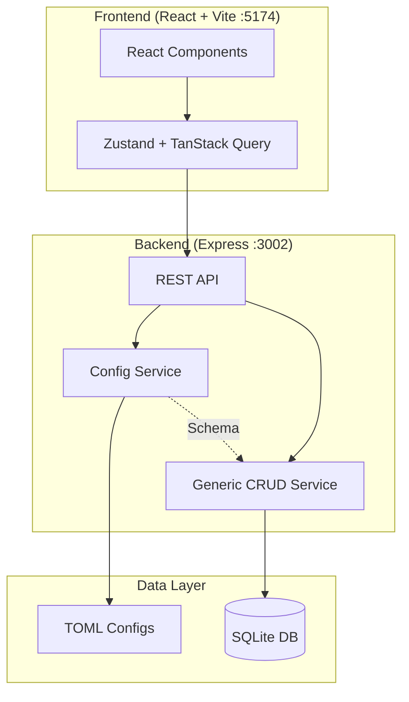

# CLAUDE.md - Mietverwaltung (66_HAUSVERWALTUNG_NEBENKOSTEN)

> **WICHTIG:** Lies zusätzlich `.claude/CLAUDE.md` für user-spezifische Einstellungen (Ports, Pfadbeschränkungen, Präferenzen).

---

## Projektübersicht

**Mietverwaltung** ist eine 100% config-driven Anwendung zur Verwaltung von Mietobjekten, Mietern, Verträgen und Nebenkostenabrechnungen.

```
┌─────────────────────────────────────────────────────────────┐
│                    MIETVERWALTUNG                           │
│         Config-Driven Property Management System            │
├─────────────────────────────────────────────────────────────┤
│  TOML Configs → Generic Services → SQLite Database          │
│       ↓              ↓                  ↓                   │
│  Business Logic   No Hardcoding    Local & Portable         │
└─────────────────────────────────────────────────────────────┘
```

## Architektur



## Tech Stack

| Schicht | Technologie |
|---------|-------------|
| Frontend | React 18 + TypeScript + Vite |
| Styling | Tailwind CSS |
| State | Zustand + TanStack Query |
| Backend | Node.js + Express |
| Database | SQLite (WAL-Modus) |
| Config | TOML-Dateien |

## Kernprinzip: 100% Config-Driven

```
┌──────────────────────────────────────────────────────────────┐
│  TOML definiert WAS                 Code definiert WIE       │
├──────────────────────────────────────────────────────────────┤
│  • Entity-Felder & Typen            • Generisches Rendering  │
│  • Validierungsregeln               • CRUD-Operations        │
│  • UI-Labels & Texte                • API-Routing            │
│  • Tabellenspalten                  • DB-Queries             │
│  • Formularfelder                   • Error-Handling         │
└──────────────────────────────────────────────────────────────┘
```

**Regel:** Änderungen an Business-Logik = TOML editieren, NICHT Code ändern.

## Lese-Gate & Steuerlogik

- **Pflichtlektüre** vor Änderungen: `.claude/*`, `.codex/*`, `.ai/*`, `CLAUDE.md`, `CODEX.md`, `AGENTS.md`, `PM_STATUS.md` (letzter JSON-Block), `BLUEPRINT_PROMPT_DE.md`, `wireframe.md`, `todo.md`, `config/config.toml`, `CHANGELOG.md`.
- `config/config.toml` ist Single Source of Truth; jede Änderung daran muss in Blueprint/BAUPLAN, AGENTS und CHANGELOG gespiegelt werden.
- `PM_STATUS.md` ist das zentrale Steuerlog. Nach jedem Agentenlauf kommt ein neuer JSON-Block mit `agent/ziel/geändert/ergebnis/blocker/next_suggestion/notes` hinzu; der Projektmanager liest nur den letzten Block.
- Detaillierte Agenten-Prompts liegen unter `.github/agents/*.agent.md`. Für Regeln/Architektur/Style verweise auf `.ai/rules.md`, `.ai/conventions.md` und `.ai/architecture.md` statt Texte zu duplizieren.

## Verzeichnisstruktur

```
66_HAUSVERWALTUNG_NEBENKOSTEN/
├── .ai/                    # Shared Truth (tool-agnostisch)
│   ├── rules.md           # Projektregeln
│   ├── architecture.md    # Architekturprinzipien
│   ├── conventions.md     # Code-Konventionen
│   └── glossary.md        # Fachbegriffe
│
├── .codex/                 # Codex (Implementierung)
│   ├── CODEX.md           # Codex-Hauptdatei
│   └── workflows/         # Implementierungs-Workflows
│
├── .claude/                # Claude (Analyse/Review)
│   ├── CLAUDE.md          # User-spezifische Claude-Docs
│   ├── system.md          # System-Prompt
│   ├── review.md          # Review-Checkliste
│   └── planning.md        # Planungs-Guidelines
│
├── config/                 # TOML-Konfigurationen
│   ├── app.config.toml    # App-Einstellungen
│   ├── entities/          # Entity-Definitionen
│   ├── views/             # View-Konfigurationen
│   ├── forms/             # Formular-Definitionen
│   ├── tables/            # Tabellen-Definitionen
│   ├── catalogs/          # Wertelisten
│   ├── navigation/        # Menü-Struktur
│   └── labels/            # UI-Texte (i18n)
│
├── src/
│   ├── client/            # React Frontend
│   ├── server/            # Express Backend
│   └── shared/            # Geteilte Typen
│
├── data/                   # SQLite + Dokumente (nicht in Git)
├── planning/              # Planungsdokumente
└── scripts/               # Utility-Scripts
```

## Entities (14 Datenmodelle)

| Entity | Beschreibung |
|--------|-------------|
| `objekt` | Immobilie (Haus, Wohnung) |
| `einheit` | Mieteinheit innerhalb eines Objekts |
| `mieter` | Mieter-Stammdaten |
| `vertrag` | Mietvertrag |
| `kaution` | Kautionsverwaltung |
| `zahlung` | Zahlungseingänge |
| `sollstellung` | Offene Posten (Soll) |
| `nebenkosten_abrechnung` | Jährliche NK-Abrechnung |
| `zaehlerstand` | Zählerstände |
| `zaehler` | Zähler-Stammdaten |
| `dokument` | Dokumentenverwaltung |
| `kostenart` | Nebenkostenarten |
| `verteilschluessel` | Umlageschlüssel |
| `buchung` | Buchungssätze |

## API-Endpunkte

```
GET    /api/{entity}          # Liste
GET    /api/{entity}/:id      # Einzeln
POST   /api/{entity}          # Erstellen
PUT    /api/{entity}/:id      # Aktualisieren
DELETE /api/{entity}/:id      # Löschen

GET    /api/config/{typ}/{name}  # Config laden
GET    /health                    # Health-Check
```

## Wichtige Befehle

```bash
npm run dev           # Client + Server parallel starten
npm run dev:client    # Nur Frontend (Vite :5174)
npm run dev:server    # Nur Backend (Express :3002)
npm run build         # Production Build
npm run typecheck     # TypeScript prüfen
npm run lint          # ESLint ausführen
```

## Ports

- **Frontend (Vite):** 5174
- **Backend (Express):** 3002

## Dokumentationsverweise

| Thema | Datei |
|-------|-------|
| Projektregeln | `.ai/rules.md` |
| Architektur | `.ai/architecture.md` |
| Code-Konventionen | `.ai/conventions.md` |
| Fachbegriffe | `.ai/glossary.md` |
| Review-Checkliste | `.claude/review.md` |
| Planungs-Guidelines | `.claude/planning.md` |
| Implementierung | `.codex/workflows/implement.md` |
| Refactoring | `.codex/workflows/refactor.md` |
| Komplett-Bauplan | `planning/BAUPLAN_MIETVERWALTUNG.md` |

## Aktueller Status

**Phase 0 abgeschlossen:**
- Projektstruktur angelegt
- Build-Config (TypeScript, Vite, ESLint, Prettier, Tailwind)
- Master-Config konsolidiert (config/config.toml, catalogs bleiben extern)
- Express-Server mit Config-API
- React-Grundgerüst mit Layout-Komponenten
- AI-Dokumentationsstruktur (.ai/, .codex/, .claude/)

**Phase 1 abgeschlossen:**
- Schema-Generator: TOML → SQL CREATE TABLE (14 Tabellen)
- Generischer Entity-Service mit CRUD-Operationen
- REST API: /api/:entity + /api/config/widths Routen (GET, POST, PUT, DELETE)
- Validierung gegen Entity-Config
- Width-Referenzsystem implementiert (20px Schritte: w40-w300 + actions)

**Aktuelle Phase:** Phase 2 - Frontend-Komponenten + Config-Konsistenz
- DataTable generische Komponente mit Width-Auflösung
- Config-gesteuertes Label-System (entity.field Format)
- Standalone Labels/Actions entfernt (nur in Tables)

**Zuletzt aktualisiert: 2025-12-19 03:39 CET (v0.2.0)

---

## Änderungs-Workflow

Nach **jeder Dateiänderung** diesen Workflow befolgen:

```
  1. ÄNDERUNG      → Datei(en) bearbeiten
         ↓
  2. TESTS         → npm run test / npm run typecheck
         ↓
     Tests OK?     → Nein → Fehler beheben → zurück zu 1.
         ↓ Ja
  3. HARDCODE      → 0%-Hardcode-Policy prüfen
         ↓
     0% Hardcode?  → Nein → Refactoren → zurück zu 1.
         ↓ Ja
  4. DOCS          → Modul-CLAUDE.md, .claude/, .codex/, Root-Docs
         ↓
  5. CHANGELOG     → @lastModified in Datei-Headern + CHANGELOG.md
         ↓
  6. STAGE         → git add (Code + Docs + Changelogs)
         ↓
  7. COMMIT        → Conventional Format
```

**Ziel:** Dokumentation + Changelog + Timestamps sind IMMER auf aktuellem Stand.
