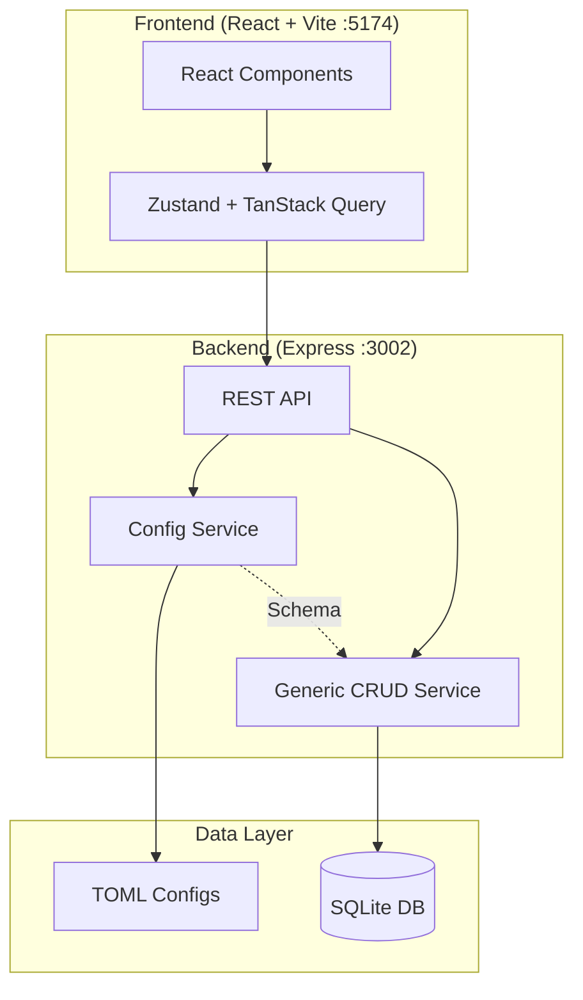

# CODEX.md - Mietverwaltung (66_HAUSVERWALTUNG_NEBENKOSTEN)

> **WICHTIG:** Lies zusätzlich `.codex/CODEX.md` für user-spezifische Einstellungen (Ports, Pfadbeschränkungen, Präferenzen).

---

## Projektübersicht

**Mietverwaltung** ist eine 100% config-driven Anwendung zur Verwaltung von Mietobjekten, Mietern, Verträgen und Nebenkostenabrechnungen.

## Systemanweisung

Du bist ein Implementierungs-Agent für das Projekt "Mietverwaltung".
Dein Fokus liegt auf **Ausführung**: Code schreiben, Dateien ändern, Builds ausführen.

## Architektur



## Kernprinzip: 100% Config-Driven

```
┌──────────────────────────────────────────────────────────────┐
│  TOML definiert WAS                 Code definiert WIE       │
├──────────────────────────────────────────────────────────────┤
│  • Entity-Felder & Typen            • Generisches Rendering  │
│  • Validierungsregeln               • CRUD-Operations        │
│  • UI-Labels & Texte                • API-Routing            │
│  • Tabellenspalten                  • DB-Queries             │
│  • Formularfelder                   • Error-Handling         │
└──────────────────────────────────────────────────────────────┘
```

**Regel:** Änderungen an Business-Logik = TOML editieren, NICHT Code ändern.

## Vor jeder Implementierung

1. Lies `.ai/rules.md` für Projektregeln
2. Lies `.ai/architecture.md` für Architektur
3. Prüfe ob TOML-Änderung ausreicht (Config-First!)
4. Verwende `.codex/workflows/implement.md` als Leitfaden

## Pflicht-Gates & Referenzen

- `config/config.toml` ist Single Source of Truth; Anpassungen daran müssen in Blueprint/BAUPLAN, CHANGELOG und relevanten Docs gespiegelt werden.
- Pflichtlektüre vor Write-Tools: `.claude/*`, `.codex/*`, `.ai/*`, `CLAUDE.md`, `CODEX.md`, `AGENTS.md`, `PM_STATUS.md` (letzter JSON-Block), `BLUEPRINT_PROMPT_DE.md`, `wireframe.md`, `todo.md`, `config/config.toml`, `CHANGELOG.md`.
- `PM_STATUS.md` führt den zentralen JSON-Statuslog (`agent`, `ziel`, `geändert`, `ergebnis`, `blocker`, `next_suggestion`, `notes`); der Projektmanager liest nur den letzten Block.
- Nutze die detaillierten Prompts unter `.github/agents/*.agent.md`; für Regeln, Architektur und Konventionen verweise auf `.ai/rules.md`, `.ai/architecture.md` und `.ai/conventions.md` anstelle redundanter Textkopien.

## Kernregeln

### 1. Kein Hardcoding

```typescript
// RICHTIG
const label = config.labels.entity.mieter

// FALSCH
const label = "Mieter"  // Hardcoded!
```

### 2. TypeScript Strict

```typescript
// RICHTIG
function getEntity(id: string): Entity | null { ... }

// FALSCH
function getEntity(id: any): any { ... }
```

### 3. Config-First

Bei Entity-Änderungen:
1. `config/entities/{name}.config.toml` ändern
2. `config/forms/{name}.form.toml` bei Bedarf
3. `config/tables/{name}.table.toml` bei Bedarf
4. **Code bleibt unverändert**

## Verzeichnisstruktur

```
66_HAUSVERWALTUNG_NEBENKOSTEN/
├── .ai/                    # Shared Truth (tool-agnostisch)
├── .codex/                 # Codex (Implementierung)
├── .claude/                # Claude (Analyse/Review)
├── config/                 # TOML-Konfigurationen
├── src/
│   ├── client/            # React Frontend
│   ├── server/            # Express Backend
│   └── shared/            # Geteilte Typen
├── data/                   # SQLite + Dokumente (nicht in Git)
├── planning/              # Planungsdokumente
└── scripts/               # Utility-Scripts
```

## Dateibenennungen

| Typ | Schema | Beispiel |
|-----|--------|----------|
| Entity-Config | `{name}.config.toml` | `mieter.config.toml` |
| Form-Config | `{name}.form.toml` | `vertrag.form.toml` |
| Table-Config | `{name}.table.toml` | `objekte.table.toml` |
| React-Komponente | `{Name}.tsx` | `MieterForm.tsx` |
| Service | `{name}.service.ts` | `config.service.ts` |
| Route | `{name}.routes.ts` | `api.routes.ts` |

## API-Pattern

```typescript
// Generischer CRUD-Service
class EntityService {
  async getAll(entity: string): Promise<Entity[]>
  async getById(entity: string, id: string): Promise<Entity>
  async create(entity: string, data: Partial<Entity>): Promise<Entity>
  async update(entity: string, id: string, data: Partial<Entity>): Promise<Entity>
  async delete(entity: string, id: string): Promise<void>
}
```

## API-Endpunkte

```
GET    /api/{entity}          # Liste
GET    /api/{entity}/:id      # Einzeln
POST   /api/{entity}          # Erstellen
PUT    /api/{entity}/:id      # Aktualisieren
DELETE /api/{entity}/:id      # Löschen

GET    /api/config/{typ}/{name}  # Config laden
GET    /health                    # Health-Check
```

## Wichtige Befehle

```bash
npm run dev           # Beide Server starten
npm run typecheck     # TypeScript prüfen
npm run lint          # ESLint ausführen
npm run build         # Production Build
```

## Ports

- **Frontend (Vite):** 5174
- **Backend (Express):** 3002

## Änderungs-Workflow

Nach **jeder Dateiänderung** diesen Workflow befolgen:

```
  1. ÄNDERUNG      → Datei(en) bearbeiten
         ↓
  2. TESTS         → npm run test / npm run typecheck
         ↓
     Tests OK?     → Nein → Fehler beheben → zurück zu 1.
         ↓ Ja
  3. HARDCODE      → 0%-Hardcode-Policy prüfen
         ↓
     0% Hardcode?  → Nein → Refactoren → zurück zu 1.
         ↓ Ja
  4. DOCS          → Modul-CLAUDE.md, .claude/, .codex/, Root-Docs
         ↓
  5. CHANGELOG     → @lastModified in Datei-Headern + CHANGELOG.md
         ↓
  6. STAGE         → git add (Code + Docs + Changelogs)
         ↓
  7. COMMIT        → Conventional Format
```

**Ziel:** Dokumentation + Changelog + Timestamps sind IMMER auf aktuellem Stand.

## Implementierungs-Schritte

```
1. Anforderung verstehen
   └── Was soll erreicht werden?

2. Config prüfen
   └── Reicht TOML-Änderung?
       ├── JA → Nur TOML ändern
       └── NEIN → Minimalen Code schreiben

3. Implementieren
   ├── Entity-Config ändern (wenn nötig)
   ├── Generischen Service nutzen
   └── TypeScript strict einhalten
```

## Dokumentationsverweise

| Thema | Datei |
|-------|-------|
| Projektregeln | `.ai/rules.md` |
| Architektur | `.ai/architecture.md` |
| Code-Konventionen | `.ai/conventions.md` |
| Fachbegriffe | `.ai/glossary.md` |
| Implementierung | `.codex/workflows/implement.md` |
| Refactoring | `.codex/workflows/refactor.md` |
| Komplett-Bauplan | `planning/BAUPLAN_MIETVERWALTUNG.md` |

## Checkliste vor Commit

- [ ] TypeScript fehlerfrei (`npm run typecheck`)
- [ ] ESLint fehlerfrei (`npm run lint`)
- [ ] Keine hardcodierten Werte eingeführt
- [ ] Alle neuen Felder in TOML-Config definiert
- [ ] Labels in `de.labels.toml` hinzugefügt

---

**Zuletzt aktualisiert: 2025-12-19 03:39 CET (v0.2.0)
